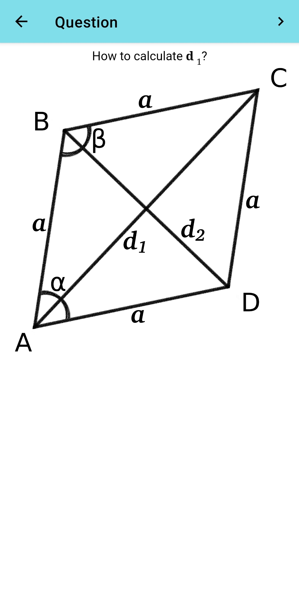
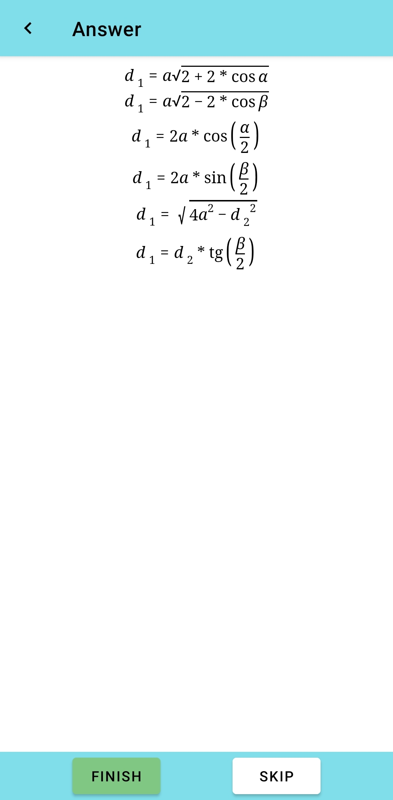
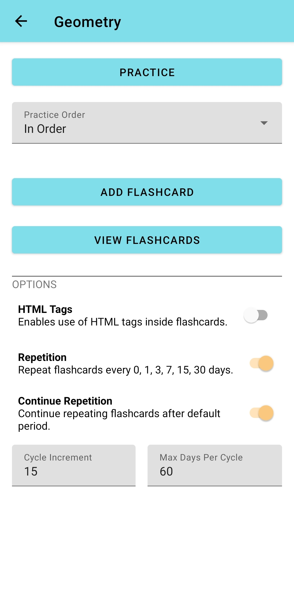
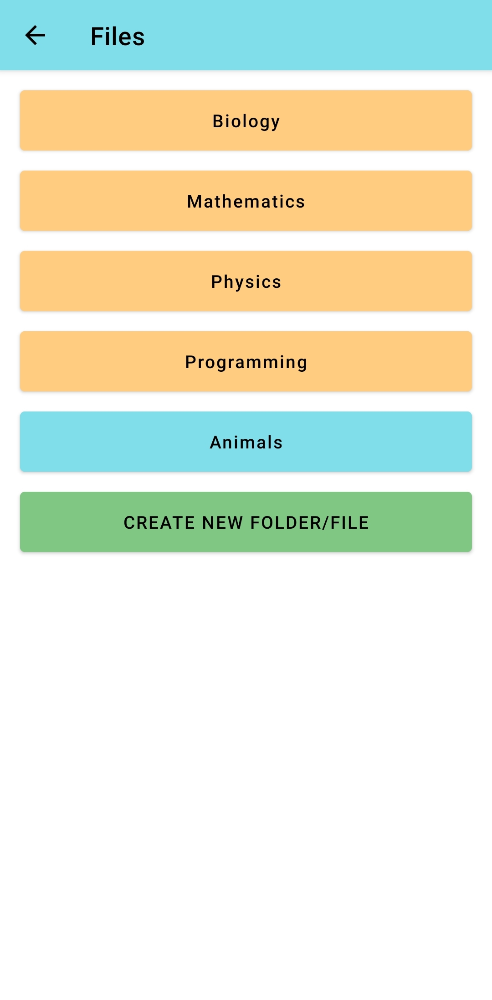

# Cognebus - Learn with flashcards and spaced repetition
Cognebus is android application for learning with flashcards. You create your own flashcards which are grouped in files. You can activate/disable spaced repetition for files. You can also practice without spaced repetition by going to file from which you want to repeat.

Install
----

Features
----
- Images inside flashcards
- Math formulas inside flashcards using jqMath

Screenshots
----

  
  
  
  

